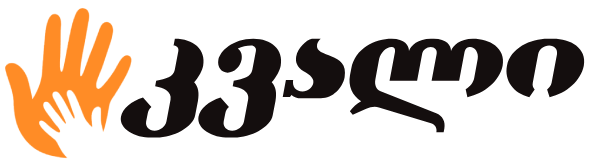

    

---

  
  
  
  
  
  
  

A Georgian fundraising and crowdfunding platform built with React and Supabase for the database and authentication.
\
[Visit the website](https://kvali.pages.dev/)

> [!WARNING] \
> If you visit the website and it seems that the campaigns aren't loading, it's because supabase has paused the project as it's on free tier

### Build locally with `bun run build` or run a development server `bun run dev`
